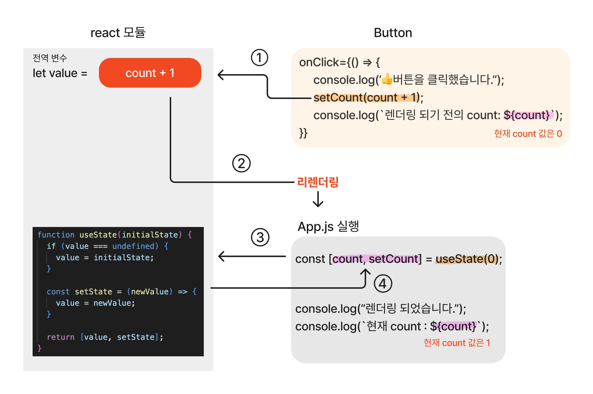

# useState 복습 및 응용

## useState 란?

함수형 컴포넌트 내에서 state 를 사용할 수 있게 해주는 '기본 hook'

### state

React 내에서의 state 란 데이터가 관리 및 저장되는 공간

#### class 및 function component 의 대조

```jsx
// 클래스형 컴포넌트
class Product extends React.Component {
  constructor(props) {
    super(props);
    this.state = {
      price: 1000;
    };
  }
}

// 함수형 컴포넌트
function Product() {
  const [price, setPrice] = useState(1000);
}
```

- 이상의 코드에서 함수형 컴포넌트와 클래스형 컴포넌트 안에서 state 를 사용한 예시를 확인할 수 있는데, 함수형 컴포넌트에서는 useState Hook 을 사용하여 첫 번쨰 argument 인 변수 price 에 상태 값으로 1000의 initialValue 를 넣어줌

- 반면에 클래스형 컴포넌트는 this.price = { price : 1000 }; 을 사용하여 price 를 1000 으로 초기화해주었음

- state 는 JS 의 객체이며, 컴포넌트 안에서 관리됨. 컴포넌트는 자신의 state 를 props 를 통해 자식 컴포넌트에 전달하고 영향을 끼칠 수 있음. state 를 가진 컴포넌트 외에 다른 컴포넌트는 접근 할 수 없기 때문에 local, 혹은 캡슐화 (encapsulation) 이라고 부르기도 함.

* props

props 도 속성을 나타내는 데이터이면서 JS 의 객체임. '컴포넌트 안에서 관리되는 state' 와 다르게 '컴포넌트에 전달한다' 는 방식 상의 차이가 있음

- React 컴포넌트들을 자신의 props 를 자체적으로 수정해서는 안되며, 입력값에 대한 결과가 변함없이 동일한 순 함수처럼 동작해야 함.

```jsx
function Introduce(props) {
  return <h1>나는 {props.color} 색을 좋아해</h1>
}

const root = 
  ReactDOM.createRoot(document.getElementById('root'));
  const element = <Introduce color='초록'/>;

  root.render(element);
```

1. `<Introduce color='초록'/>;` : element 로 root.render() 를 호출함
2. props 로 { color: '초록' } 단일 객체를 Introduce 컴포넌트에 호출되어 전달 받고, 화면에는 Introduce 컴포넌트가 반환된 값, 즉 '나는 초록색을 좋아해!' 가 나타남

- 이상의 경우에서 해당 컴포넌트에 단일 객체로 전달한다는 표현이 있는데, 이 '단일 객체' 가 props 에 해당함

### setState
이상에서 state 는 컴포넌트 안에서 관리되고 있는 저장되는 공간이라고 확인했음

state 의 값을 갱신하기 위해서 함수형 컴포넌트와 클래스형 컴포넌트에서는 'useState' 함수를 이용함

형식 :
```jsx
<button onClick={ () => this.setState({price: this.state.price + 100})}>
가격 인상 ↑
</button>
```
클래스형 컴포넌트에서의 this.setState 의 사용 예시

- React 의 기본 Hook 에 해당하는 setState 함수를 통해서 '새 state 값을 반환받아서 컴포넌트 리렌더링을 큐에 등록하고 최신 state 로 갱신' 해줌 또한 props 와 동일하게 setState 함수로 동일성이라는 특징을 갖고 있어, '리렌더링 시에 변경되지 않음.'

### useState

이상까지들의 예시들은 클래스 컴포넌트를 포함하여 설명이 이루어짐. React Hook 이 등장하기 전에, 함수 컴포넌트 안에서는 state 사용이 불가능했기 때문인데, 이제는 React 기본 Hook 인 useState 의 등장으로 함수 컴포넌트 안에서도 state 를 사용할 수 있음

- 이제 명심해야 할 것은 state 와 useState 는 다른 개념이었다는 점임

useState 의 특징 :

1. 상태를 유지하는 값인 state 변수와 그 값을 갱신하는 setState 함수를 쌍으로 반환.
2. useState 호출 시, 컴포넌트 state 는 완전히 독립적으로 이루어져 작동됨.
3. 함수형 컴포넌트에서는 state 의 inintalValue 로 객체를 포함한, 배열, 문자, 숫자 타입을 가질 수 있으며, 하나의 컴포넌트 안에서 여러 개의 useState Hook 을 사용 가능

```jsx
function Person() {
  const [ age, setAge ] = useState(18);   // number
  const [ grade, setGrade] = useState('A');   // string
  const [ todos, setTodos ] = useState({subject: 'Math'});  // 배열 / 객체
  const [ check, setCheck ] = useState(false);  // boolean
  // 기타 추가 필드를 집어넣을 수 있을텐데, 이렇게 한 줄이 필드 및 setter 임
}
```

## useState 를 사용하는 이유
React 에서 상태 관리 할 때 일반 변수가 아닌 state 변수를 활용하는 이유로는 DOM 렌더링과 밀접한 연관이 있음

### 일반 변수를 사용 했을 때

예를 들어 버튼을 클릭 할 때마다 마신 물이 몇 잔인지 기록한다고 가정했을 때, 버튼의 클릭 횟수에 따라 변하는 상태를 저장할 수 있도록 일반 변수인 drink 를 0 으로 초기화하고 버튼을 클릭하여 drinkWater 함수를 호출하면 drink 변수에 클릭 횟수가 누적되도록 하고 출력함

```jsx
function App() {
  let drink = 0;  // 일반 변수 사용

  const drinkWater = () => {
    drink += 1;
    console.log(`버튼 클릭 횟수 : ${drink} 번`);
  };

  return (
    <>
    <p>
      🔋 오늘은 물을 <strong> {drink} </strong> 잔을 충전했습니다
    </p>
    <br/><br/><br/>
    <button onClick={drinkWater}>🧪</button>
    </>
  );
}

export default App;
```
이상의 코드를 App10.jsx 를 붙여넣고 실행할 수 있도록 모든 과정을 작성

터미널에서도 써야하는 명령어 있을 거임  -> npm run dev : React project 를 실행시키는 명령어

이상을 해결했을 때, 콘솔 창에서의 drink 값이 변동이 있지만, 실제 화면에서는 변경된 값이 렌더링이 이루어지지 않고 있음

이유 :
- 컴포넌트가 DOM 에서 렌더링 될 때 생명주기 이벤트가 발생하는 것에 있음.

- 함수 컴포넌트 안에서 일반 변수는 렌더링 될 때 마다 초기화되지만, state 변수를 사용하는 경우 변경되는 값을 반영하여 업데이트 해주기 때문

#### State 변수를 사용하게 됐을 때

- 그렇다면 useState 를 사용하여 drink 의 상태를 저장하게 됐을 경우

```jsx
import { useState } from 'react';

function App() {
  const [drink, setDrink] = useState(0);
  const drinkWater = () => {
    setDrink(drink => drink +1);
  };

  return (
    <>
    <p>
      🔋 오늘은 물을 <strong> {drink} </strong> 잔을 충전했습니다.
    </p>
    <br/><br/><br/>
    <button onClick={drinkWater}>🧪</button>
    {console.log(`버튼 클릭 횟수 : ${drink} 번`)};
    </>
  );
}

export default App;
```
### React 가 useState 사용을 권장하는 이유

함수 컴포넌트는 state 변경으로 리렌더링이 되면 컴포넌트 내부에 있는 변수들이 모두 초기화가 이루어짐. 기존의 컴포넌트가 새로고침되는 것이 아니고, state 의 최신 상태를 새로운 컴포넌트로 갱신해주는 것에 가깝다고 볼 수 있음

useState 는 상태 주기 메서드와 state를 함수 컴포넌트에서 사용할 수 있게 만들어주고, 함수의 특성을 활용하여 현재 상태 값을 가지고 있는 state 변수와 값을 변경시켜주는 setState 함수를 사용하여 배열을 반환해줌

```jsx
const [state, setState] = useState(initialValue);
```

App11.jsx 생성

- 버튼을 클릭할 때마다 화면이 리렌더링 되면서 count 횟수가 증가함
- 콘솔 창을 통해 컴포넌트가 렌더링되고 count 변수의 값이 갱신되는데, 해당 과정을 풀이하자면

1. 처음 서버를 실행했을 때, 컴포넌트가 렌더링되고 초깃값이 담긴 count 를 출력 (f5)
2. 이후 버튼을 클릭하면 setCount 함수가 호출되고 현재 시점의 count 를 출력함
  - 렌더링 전의 count : 0 (해당 부분이 현재 시점의 count)
3. 렌더링이 된 후, 현재 시점의 count 값을 출력
  - 현재 count : 1 (이 부분이 바뀌고 난 부분이 됨)



1. setCount 함수가 호출되면 갱신할 값을 react 모듈 내 선언된 전역 변수에 할당.
2. 이후 컴포넌트가 리렌더링되고 다시 App.jsx 가 실행됨. 그럼 초기값 0 을 다시 useState 에 전달하면서 useState 함수가 호출
3. 호출된 useState 함수는 먼저 react 모듈 내에 선언된 전역 변수에 값이 있는 지를 확인 -> 값이 있다면 초기값 0이 무시됨. -> 그리고 전역 변수에 저장해두었던 count 값과 setCount 를 반환
4. 반환받은 두 값은 각각 count 변수와 setCount 함수에 재대입

- 이상의 과정을 정리하자면 setCount 함수 자체는 현재의 state 변수를 변경시키는 것이 아니라 리렌더링이 되고 난 이후의 useState 가 반환한 값을 변경해주고 컴포넌트를 리렌더링 시켜주게됨.

### useState 응용

### useState 와 이벤트를 사용한 로그인 폼 작성

App12.jsx 생성

```jsx
function LoginForm() {
  const [id, setId] = useState('');
  const [password, setPassword] = useState('');

  return;
}

function App () {
  return (
    <div>
      <LoginForm />
    </div>
  )
}

export default App;
```

- id / password 라는 state 변수를 선언함. 초기값으로 공백을 줌 -> 나중에 input 사용할건데 빈칸으로 시작하기 위해서 해당 방법으로 처리했음.

```jsx
function LoginForm() {
  const [id, setId] = useState('');
  const [password, setPassword] = useState('');

  const handleLoginForm = (event) => {
    event.preventDefault();  
  };

  return;
}

function App () {
  return (
    <div>
      <LoginForm />
    </div>
  )
}

export default App;
```
3. 로그인 폼을 핸들링하는 함수 작성
- handleLoginForm 에 event.preventDefault() 메서드 : form 안에 있는 submit 역할을 하는 로그인 버튼을 눌렀을 때 창을 새로고침 하지 않도록 막는 역할

- Event 인터페이스의 preventDefault() 메서드는 이벤트를 명시적으로 처리하지 않는 경우, 해당 이벤트에 대한 '사용자 에이전트' 의 기본 동작을 실행하지 않도록 지정

* 사용자 에이전트

사용자 에이전트(user agent)는 사용자를 대표하는 컴퓨터 프로그램으로, 웹 맥락에선 브라우저를 의미합니다.

브라우저 외에도, 웹 페이지를 스크랩하는 봇, 다운로드 관리자, 웹에 접근하는 다른앱도 사용자 에이전트입니다. 브라우저는 서버에 보내는 모든 요청에 사용자 에이전트(UA) 문자열이라고 부르는, 자신의 정체를 알리는 User-Agent HTTP 헤더를 보냅니다. 이 문자열은 보통 브라우저 종류, 버전 번호, 호스트 운영체제를 포함합니다.


```
Warning: You provided a `value` prop to a form field without an `onChange` handler. This will render a read-only field. If the field should be mutable use `defaultValue`. Otherwise, set either `onChange` or `readOnly`. Error Component Stack
    at input (<anonymous>)
    at label (<anonymous>)
    at form (<anonymous>)
    at LoginForm (App12.jsx:10:23)
    at div (<anonymous>)
    at App (<anonymous>)
overrideMethod @ hook.js:608
printWarning @ chunk-FMOPAGIP.js?v=d07c40d2:519
error @ chunk-FMOPAGIP.js?v=d07c40d2:503
checkControlledValueProps @ chunk-FMOPAGIP.js?v=d07c40d2:1808
initWrapperState @ chunk-FMOPAGIP.js?v=d07c40d2:1936
setInitialProperties @ chunk-FMOPAGIP.js?v=d07c40d2:7576
finalizeInitialChildren @ chunk-FMOPAGIP.js?v=d07c40d2:8354
completeWork @ chunk-FMOPAGIP.js?v=d07c40d2:16312
completeUnitOfWork @ chunk-FMOPAGIP.js?v=d07c40d2:19250
performUnitOfWork @ chunk-FMOPAGIP.js?v=d07c40d2:19232
workLoopSync @ chunk-FMOPAGIP.js?v=d07c40d2:19163
renderRootSync @ chunk-FMOPAGIP.js?v=d07c40d2:19142
performConcurrentWorkOnRoot @ chunk-FMOPAGIP.js?v=d07c40d2:18704
workLoop @ chunk-FMOPAGIP.js?v=d07c40d2:195
flushWork @ chunk-FMOPAGIP.js?v=d07c40d2:174
performWorkUntilDeadline @ chunk-FMOPAGIP.js?v=d07c40d2:382
```
- LoginForm 에 return 을 작성한 후에 이상과 같은 오류 메시지를 확인 할 수 있음
- id / password 의 상태를 바꿀 수는 있지만, 아직 input 에 값을 입력할 수 없는 상태임
- 즉, id 와 password 의 state 만 선언해주었을 뿐, 어떤 동작을 하라고 지시하지 않았기 때문에 state 값을 변경시키기 위한 이벤트를 등록해주어야함.

- input 에 입력한 값을 React 가 인지하고 동작할 수 있도록 onChange 라는 이벤트를 발생시켜서 state 값을 변경시켜주어야 value 값이 변경됨. 그러므로 form 태그 뿐만 아니라 id 와 password 태그에도 각각 onChange 라는 이벤트를 주기 위한 이벤트 핸들러 함수가 추가적으로 필요함

```jsx
  const handIdInput = (event) => {
    setId(event.target.value);
  };

  const handlePasswordInput = (event) => {
    setPassword(event.target.value);
  };
```

이상의 코드를 LoginForm 컴포넌트에 삽입하고, return 의 input 부분에 onChange 속성에 각각의 함수를 집어넣어줬음.

- 최종 코드

```jsx
function LoginForm() {
  const [id, setId] = useState('');
  const [password, setPassword] = useState('');

  const handleLoginForm = (event) => {
    event.preventDefault();
    // console.log('로그인 버튼을 클릭함');   => onChange 의 흐름을 증명하기 위한 테스트 코드
    alert(`Id: ${id}\nPassword: ${password}`)
  };

  const handIdInput = (event) => {
    // console.log('아이디를 입력함');
    setId(event.target.value);
  };

  const handlePasswordInput = (event) => {
    // console.log('비번을 입력함');
    setPassword(event.target.value);
  };

  return(
    <form onSubmit={handleLoginForm}>
      <label>
        Id : 
        <input type="text" value={id} placeholder="아이디를 입력하시오." onChange={handIdInput}/>
      </label>
      <label>
        Password : 
        <input type="password" value={password} placeholder="비밀번호를 입력하시오." onChange={handlePasswordInput}/>
      </label>
      <button type="submit">Login</button>
    </form>
  );
}

function App () {
  return (
    <div>
      <LoginForm />
    </div>
  )
}

export default App;
```

# useRef 복습 및 응용
형식 :
```jsx
const ref = useRef(initialValue);
```

함수형 컴포넌트에서 useRef 는 순수 Js 객체를 생성. 생성된 객체는 {current : initialValue} 의 형태로 반환되기 때문에 ref.current 의 형태로 값의 접근이 가능함 (-> 어제 그래서 current 썼었음)
따라서 useRef는 .current 프로퍼티에 변경 가능한 값을 담고 있는 일종의 상자와 같다고 표현 가능함

## useRef 의 사용 목적
1. 특정 DOM 에 접근하여 제어해야할 경우 (어제 document.title 사용함)
2. 렌더링과 관계없이 값을 변경하고 싶을 경우

- Js 의 경우 getElementById, qureySelector 등의 메서드를 통해 DOM에 접근하여 제어가 가능했음. 하지만 React 의 경우에는 직접 DOM 을 조작하는 것을 권장하지 않음

- 그럼에도 불구하고 스크롤바 위치를 파악해야 하는 경우나 input 요소에 자동 포커스를 설정해 주어야 할 때 처럼 직접 DOM 을 제어해 주어야 하는 예외적인 상황이 발생할 수 있는데, 이 때 useRef를 사용해 DOM 에 접근 할 수 있음

* React 에서 DOM 직접 조작을 권장하지 않는 이유

React 는 DOM 이 아니라 virtual DOM 을 사용하기 때문에 DOM 조작으로 인한 브라우저 렌더링을 최소화한다는 장점을 지니고 있는데, DOM 을 직접 조작하게 된다면 React 의 이상의 장점을 놓치는 일이 발생하기 때문에 권장하지는 않음.

또한 useRef 를 사용하여 반한된 객체 {current : initialValue} 는 컴포넌트의 전 생애주기를 통해 유지됨.

*컴포넌트의 생애주기 : DOM 에 마운트되고 언마운트 되기 까지의 전 과정

useRef는 .current 의 값이 변경되더라도 컴포넌트 리렌더링을 '발생시키지 않고' 렌더링을 할 때 동일한 ref 객체를 제공함

즉, 컴포넌트가 계속해서 렌더링이 되더라도 컴포넌트가 언마운트 되기 전까지는 값이 그대로 유지됨. 따라서 컴포넌트의 값의 변경은 관리해야하지만 리렌더링을 발생시킬 필요는 없을 때 활용 가능함.

## useRef vs. useState vs. 일반 변수

### useRef vs. useState

- 두 개념 다 상태 관리를 위해 사용 가능
- useState 의 경우 state 가 변경된 후에 리렌더링을 진행하지만
- useRef 는 리렌더링을 진행하지 않음. 내부적으로 값이 변하여 컴포넌트가 렌더링되기 전까지는 변경된 값이 보이지 않다가 렌더링이 되는 시점이 변경된 값이 보임.

- 이상의 차이로 인해 렌더링이 필요한 state 의 경우에는 useState 를 사용하는 용도와 생애 주기 내내 변화하는 값을 가리키고 있다는 차이점이 존재함

- 즉 useState 는 컴포넌트의 생애 주기와 밀접한 연관이 있는 요소이므로 렌더링과 관련이 없는 값을 저장하기에는 적합하지 않으며, useRef 는 state 렌더링과 무관한 값과 이전의 값을 저장하기에 적합하다고 할 수 있음

- 해야할 건 뭐다? 상황에 맞게 적절한 Hook 을 선택해서 작성해라.

### useRef 사용하기

App13.jsx 생성


```jsx
export default function App() {
  const [stateCount, setStateCount] = useState(0);
  const refCount = useRef(0);

  return (
  <div className="App">
    <button onClick={()=> setStateCount(preCount => preCount +1)}>
      State Button
    </button>
    <br /><br /><br />
    <button onClick={() => refCount.current += 1}>
      Ref Button
    </button>
    <br /><br /><br />
    <div>useState Count : {stateCount}</div>
    <div>useRef Count : {refCount.current}</div>
  </div>
  );
}
```

이상의 코드에서 증명 할 수 있는 점은 State 버튼을 누르게 되면 매번 useState Count 값이 1씩 증가하는 것을 확인할 수 있지만, Ref 버튼을 눌렀을 때에는 useRef Count 는 변경된 값이 렌더링이 일어나지 않고 있음

그렇다면 useRef 를 사용한 Ref Count 값은 변경이 실제로 일어나지 않는가 ? -> X

내부적으로는 카운트가 올라가고 있지만 화면에 바로 렌더링이 일어나지 않음

그래서 State 버튼을 다시 눌러 리렌더링을 일으키게 됐을 때 변경점이 한꺼번에 나타난다는 점을 확인 할 수 있음

즉, state 가 변화됐을 때 (useState 에 해당하는 버튼을 눌렀을 때) refCount.current 의 값도 같이 렌더링됐음을 확인 할 수 있음

이상의 이유는 useRef 로부터 생성된 객체는 component 의 생애 주기 내내 변화하는 값을 가리키고 있기 때문에 current 값이 변화해도 리렌더링에 관여하지 않는다는 것에 있다고 볼 수 있음

## useRef 와 DOM

- useRef 를 사용하는 이유로는 특정 DOM 에 접근하여 제어할 필요가 없을 때였음
React 에서 DOM 을 선택하기 위해서는 ref 를 사용하면 되는데 어제 작성한 예시가 대표적임

### useRef 로 특정한 DOM 선택
App14.jsx 생성

```jsx
import { useRef } from "react";
import './App.css'

export default function App(){
 const textInput = useRef(null);   // textInput {current: null}

  const clickBtn = () => {
    console.log('클릭');
  }

  const handleClickBtn = () => {
    console.log('useRef 클릭')
    textInput.current.focus();  // useRef 가 가리키는 input 태그에 포커스 이벤트 적용
    };

  return(
    <div>
      <input type="text" />
      <input type="button" value= 'ref x' onClick={clickBtn}/>
      <br />
      <br />
      <br />
      <input type="text" ref={textInput}/>
      <input type="button" value='ref 0' onClick={handleClickBtn}/>
    </div>
  )
}
```

20250303 수업 시에 차이점에 대한 이론적인 배경 설명 후 시작